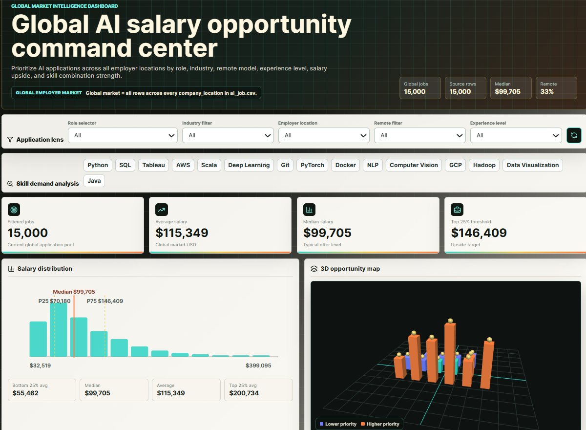
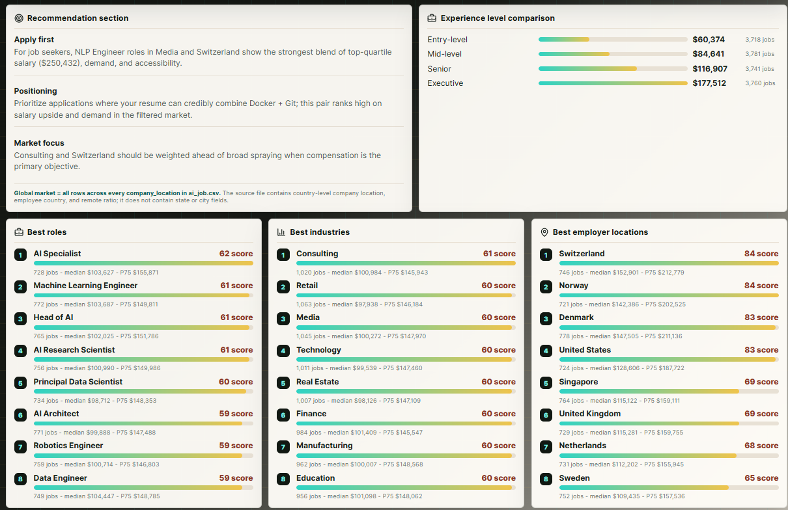
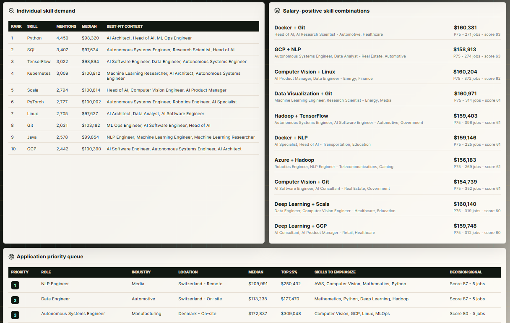
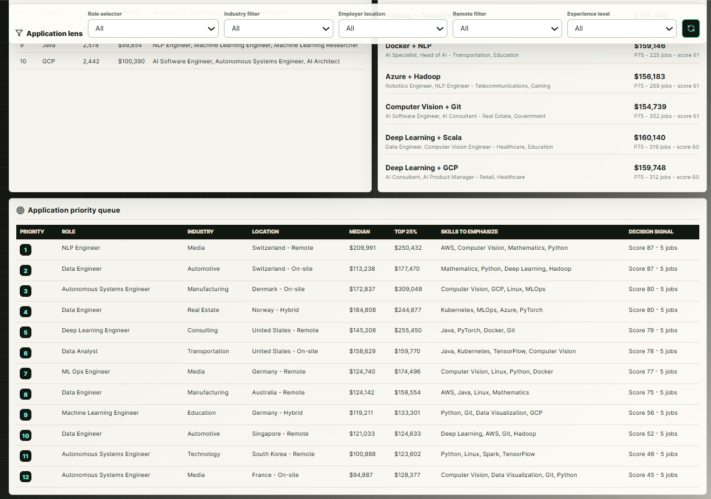

# Global AI Salary Opportunity Command Center

An interactive decision-support dashboard for exploring salary opportunities across the global AI job market.



## Project overview

The Global AI Salary Opportunity Command Center is an interactive TypeScript and Vite application built from 15,000 global AI job records.

The dashboard helps job seekers compare roles, industries, employer locations, experience levels, remote-work arrangements, salaries, technical skills, and skill combinations.

It is designed to answer the following question:

> Across the global AI job market represented in the source data, which employer locations, roles, industries, remote-work models, and skill combinations offer the strongest salary opportunities, and how should a job seeker prioritize applications?

## Development approach

This project was developed through an AI-assisted coding workflow using
OpenAI Codex.

I defined the product requirements, analytical questions, dashboard logic,
scoring assumptions, interface behavior, and validation criteria. Codex
supported code generation, debugging, refactoring, and implementation.
I reviewed the resulting code, tested the application, and validated the
dashboard metrics against the underlying dataset.

## Key features

- Interactive role selector
- Industry, employer-location, remote-work, and experience filters
- Technical skill filters
- Global salary summary metrics
- Salary distribution and quartile analysis
- Median and average salary comparisons
- Role opportunity rankings
- Industry opportunity rankings
- Employer-location opportunity rankings
- Experience-level salary comparison
- Individual skill-demand analysis
- Salary-positive skill-combination analysis
- Dynamic job-search recommendations
- Ranked application-priority queue
- Rotating 3D opportunity map built with Three.js
- Reset controls for restoring the complete global market view

## Dashboard views

### Global market overview

The main dashboard presents global market metrics, interactive application filters, salary distribution, and the 3D opportunity map.


### Recommendations and market rankings

The recommendation section identifies promising role, industry, location, and skill-positioning opportunities. The dashboard also compares experience levels and ranks roles, industries, and employer locations.



### Skills and skill combinations

The skills section compares individual skill demand and highlights technical skill combinations associated with stronger salary opportunities.



### Application priority queue

The application-priority queue ranks role, industry, location, work arrangement, salary, and skill combinations to help users focus their job search.



## Data scope

The dashboard includes every valid row from the source CSV and every employer country represented in the `company_location` field.

The global market is defined as all valid records across every employer location in the source data.

All salary calculations and dashboard displays use the `salary_usd` field. The original `salary_currency` field is retained only as source metadata.

The source data includes fields related to:

- Job title
- Employer country
- Employee residence country
- Industry
- Experience level
- Education level
- Company size
- Remote-work ratio
- Technical skills
- Salary in U.S. dollars
- Original salary currency

The dataset contains country-level employer and employee locations. It does not contain state- or city-level location fields.

## Dashboard data

The processed data used by the browser application is stored at:

```text
public/data/ai-salary-analysis.json
```

Because files inside Vite's `public` directory are served from the website root, the application accesses this file through:

```text
/data/ai-salary-analysis.json
```

The source preparation file is:

```text
data/ai_job.csv
```

The root `data/` directory should be included in the public repository only when redistribution is permitted by the dataset's license or terms of use.

## Opportunity analysis

The dashboard evaluates opportunities using several factors, including:

- Salary level
- Top-quartile salary
- Number of available records
- Role demand
- Employer location
- Industry
- Experience level
- Remote-work arrangement
- Individual skills
- Skill combinations

Opportunity scores and recommendations are intended to support exploration and application prioritization. They should not be interpreted as causal estimates or guarantees of compensation.

Results based on small filtered samples should be interpreted carefully. Salary differences may also reflect factors not represented in the dataset.

## Technology

- TypeScript
- Vite
- HTML
- CSS
- JavaScript data transformation
- Three.js
- Interactive data visualization
- Responsive dashboard design

## Project structure

```text
global-ai-salary-opportunity-dashboard/
├── data/
│   └── ai_job.csv
├── public/
│   └── data/
│       └── ai-salary-analysis.json
├── qa/
├── scripts/
├── screenshots/
│   ├── dashboard-overview1.png
│   ├── dashboard-overview2.png
│   ├── dashboard-overview3.png
│   └── dashboard-overview4.png
├── src/
├── .gitignore
├── index.html
├── package.json
├── package-lock.json
├── README.md
├── tsconfig.json
├── tsconfig.node.json
└── vite.config.ts
```

Some supporting directories may be omitted from the public repository when they contain temporary output or data that cannot be redistributed.

## Run locally

### Prerequisites

Install:

- Node.js
- npm

### Install dependencies

```bash
npm install
```

### Start the development server

```bash
npm run dev
```

Open the application at:

```text
http://127.0.0.1:5173/
```

The terminal may display a different local URL depending on the Vite configuration and available port.

## Build

Create a production build:

```bash
npm run build
```

A successful build creates the generated production files inside:

```text
dist/
```

The `dist/` directory is generated locally and should not be committed to the repository.

## Validate

Run the production build and interface-verification script:

```bash
npm run build
node scripts/verify-ui.mjs
```

Before publishing changes, confirm that:

- The dashboard opens without errors
- The processed JSON file loads successfully
- Global summary metrics display correctly
- Role and industry filters work
- Employer-location filters work
- Remote-work and experience filters work
- Skill buttons work
- Reset controls work
- Recommendations update correctly
- The application-priority queue displays correctly
- No outdated U.S.-only project title remains
- No browser-console or data-loading errors appear

## Using the dashboard

1. Select a role or leave the role selector set to all roles.
2. Filter by industry, employer location, remote-work arrangement, or experience level.
3. Select technical skills to examine skill demand and salary effects.
4. Review the salary distribution and quartile benchmarks.
5. Compare the highest-ranked roles, industries, and employer locations.
6. Review salary-positive skill combinations.
7. Use the recommendation section to identify promising areas of focus.
8. Review the application-priority queue to prioritize specific opportunities.
9. Use the reset button to return to the complete global market view.

## Interpretation notes

The dashboard reflects only the records contained in the source dataset.

The results should not be interpreted as a complete representation of every AI job or salary worldwide. Differences in sample size, employer mix, role definitions, local labor markets, and reporting practices may affect comparisons.

Salary-positive skills and skill combinations represent associations within the dataset. They do not prove that adding a particular skill will independently cause a salary increase.

## Related project

The SQL and Tableau analysis associated with this dashboard is available here:

[Global AI Jobs Market Analysis — PostgreSQL, SQL, and Tableau](https://github.com/Ma0285/global-ai-jobs-market-analysis-sql)

## Data-use notice

Before publishing the original CSV or processed records, review the source dataset's license and redistribution terms.

A processed JSON file may still count as redistribution when it contains records or values derived from the original dataset. Include public data files only when their use and redistribution are permitted.
